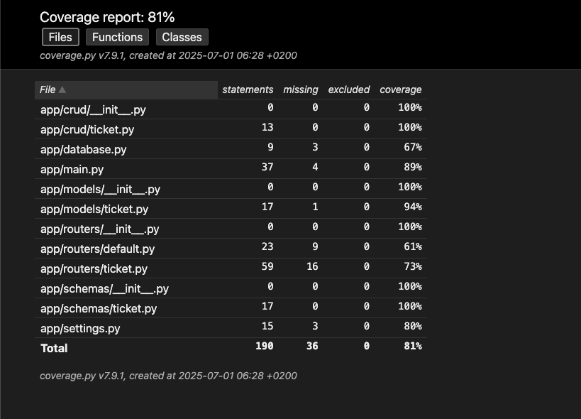

🎟️ Ticket Management Backend – FastAPI + SQLModel

This project is a lightweight, modern backend for a ticket management application, built with FastAPI and SQLModel 🚀. It provides RESTful endpoints to create, read, update, and delete support tickets, while ensuring clean architecture, type safety, and maintainability. Ideal for bootstrapping professional-grade FastAPI apps in minutes.

⸻

## 📁 Project structure
```scss
Backend/
│
├── assets/
│
├── app/
│   ├── __init__.py
│   ├── main.py                # FastAPI app initialization and main routes
│   ├── database.py            # Database setup and session management
│   ├── models/                # SQLModel models
│   │   ├── __init__.py
│   │   └── ticket.py          # Ticket model
│   ├── schemas/               # Pydantic schemas for data validation
│   │   ├── __init__.py
│   │   └── ticket.py          # Ticket schemas
│   ├── routers/               # API endpoints
│   │   ├── __init__.py
│   │   └── endpoints/
│   │       ├── __init__.py
│   │       └── ticket.py      # Ticket endpoints
│   ├── crud/                  # CRUD operations mainly
│   │   ├── __init__.py
│   │   └── ticket.py          # Ticket CRUD operations
│   └── settings.py            # Configuration settings
│
├── tests/                     # Test files
│   ├── __init__.py
│   └── test_ticket.py         # Different Test cases for ticket API endpoints
│
├── requirements.txt           # Python dependencies
├── README.md                  # Project documentation
└── .env                       # Environment variables
```


⸻

📦 Dependency Management with uv (Recommended)

The project is designed to work with uv – a fast Python package manager for modern workflows.

🧪 Installation Steps

Step	Command
1. Install dependencies	uv sync
2. Run the app	python app/main.py

👉 uv is optional – you can also use venv + pip (see below).

⸻

💡 Alternative: Use venv + pip

Step	Command
1. Create venv	python -m venv .venv
2. Activate venv	source .venv/bin/activate (or venv\Scripts\activate on Windows)
3. Install deps	pip install -r requirements.txt
4. Run the app	python app/main.py


⸻

🗄️ Database Handling with SQLModel

All database operations are handled using SQLModel, which combines the simplicity of Pydantic with the power of SQLAlchemy. Read more here 👉 https://sqlmodel.tiangolo.com

⸻

🧪 Running Tests (Pytest)

Tests are located in the /tests folder and use pytest. To execute:

python -m pytest tests/

📊 Code coverage: ~81%



⸻

🐳 Run with Docker

Step-by-step guide:

Step	Command
1. Build image	docker build -t ticket_mgmt .
2. Run container	docker run -d --name ticket_mgmt_container -p 8000:8000 ticket_mgmt

Once running, visit: http://localhost:8000

⸻

📜 Logs

Logs are stored in tickets_management_backend/logs/*.log. Check here if something goes wrong 🧐

⸻

Enjoy your ticket management backend! 🎉